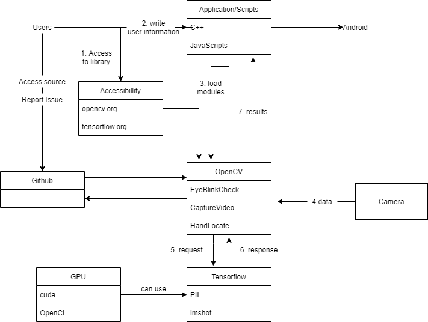
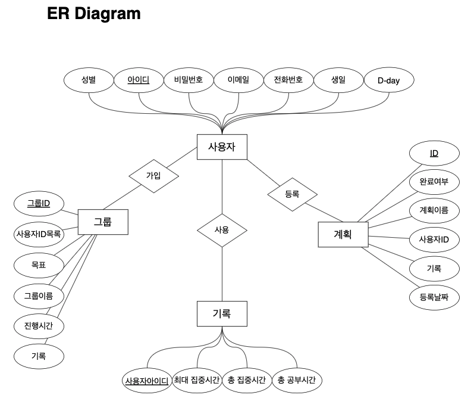
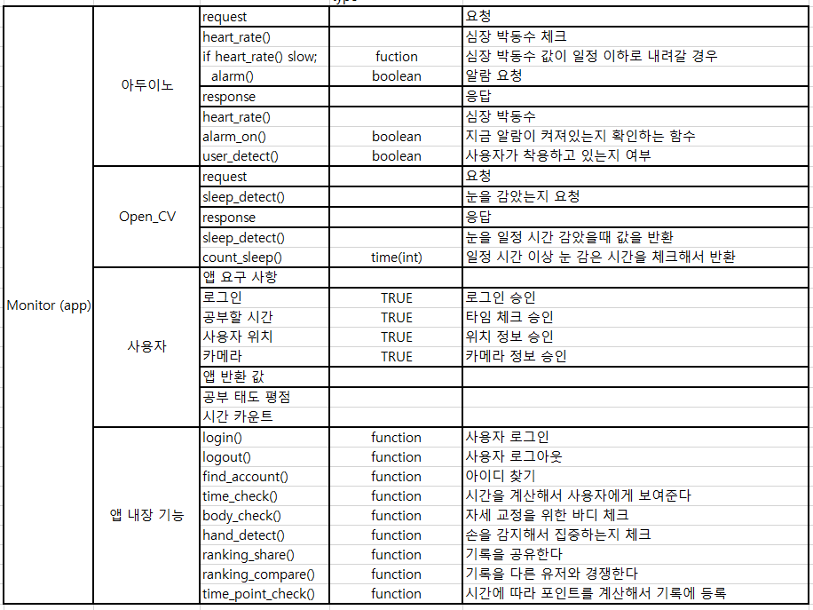

## 전체 구현도 예상 시나리오  
유저는 사용자 정보를 입력하여 접근을 허용한다. 프론트단에 포함된 OpenCV를 통해 받아온 데이터를 영상처리 과정 후 정제된 값을 프론트로 다시 올려준다. OpenCV의 학습 데이터는 Github를 통해 업데이트를 받고 인터넷을 통해 언제나 교환이 가능하게 한다.  

  

추가적으로 Tensorflow.js를 활용해 OpenCV에 부족한 기능을 추가할 예정이다. 예정된 개발 추가 내용은 자세 교정을 위한 목과 눈높이 사이의 길이를 추가 할 예정이다.  

## Js 코드 함수 구성  
비디오를 사진이라 생각하고 각 프레임 단위로 체크를 하고 비디오 처럼 출력해주는 함수를 생각하였다. 동영상을 받아 함수 부분만큼 알고리즘을 실행시킨후 내보낸다. 이 과정을 ```stopCamera()```라는 함수가 실행되기 전까지 반복을 시켜주게 만들었다.  
```js
function processVideo() {
  stats.begin();
  canvasInputCtx.drawImage(video, 0, 0, videoWidth, videoHeight);
  let imageData = canvasInputCtx.getImageData(0, 0, videoWidth, videoHeight);
  srcMat.data.set(imageData.data);
  cv.cvtColor(srcMat, grayMat, cv.COLOR_RGBA2GRAY);
  let faces = [];
  let eyes = [];
  let size;
  if (detectFace.checked) {
    //얼굴 감지 변수
    let faceVect = new cv.RectVector();
    let faceMat = new cv.Mat();
    cv.pyrDown(grayMat, faceMat);
    size = faceMat.size();
    faceClassifier.detectMultiScale(faceMat, faceVect);
    for (let i = 0; i < faceVect.size(); i++) {
      let face = faceVect.get(i);
      faces.push(new cv.Rect(face.x, face.y, face.width, face.height));
      let eyeVect = new cv.RectVector();
      let eyeMat = new cv.Mat();
      cv.pyrDown(grayMat, eyeMat);
      eyeClassifier.detectMultiScale(eyeMat, eyeVect);
      for (let i = 0; i < eyeVect.size(); i++) {
        let eye = eyeVect.get(i);
        eyes.push(
          new cv.Rect(face.x + eye.x, face.y + eye.y, eye.width, eye.height)
        );
      }
      eyeMat.delete();
      eyeVect.delete();
    }
    faceMat.delete(); 
    faceVect.delete();
  }
  canvasOutputCtx.drawImage(canvasInput, 0, 0, videoWidth, videoHeight);
  if (eyes.length == 0) {
    count += 1;
    if (count > 30) {
      if (!timer) {
        alert("please forcus");
        timer = true;
        now1 = new Date();
      } else {
        now2 = new Date();
        timeGap = now2.getTime() - now1.getTime();
        clickButton(timeGap);
        timer = false;
        count = 0; 
      }
    }
  }
  stats.end();
  requestAnimationFrame(processVideo);
}
```  

캡스톤 발표를 위해 눈과 얼굴을 그려줄 ```canvasOutputCtx()```를 만들어 주었다.

## 서버의 구체적인 구현  

세부적인 구현은 DB 개발과 협업을 할 예정이며 DB에 대한 예상도는 아래 사진과 같은 구현이 예상된다.  

  

프로젝트 구현 단계에서 값들은 충분히 바뀔 수 있으며 기본적인 구현은 위 사진을 따를 예정이다. 이 밖에 추가할 정보는 기능적인 구현에 대한 대략적인 예시이다. 아래 그림을 참조하겠다.  

  

가장 기본적인 기능만 구현했으며 위 사진의 기능을 무조건 구현하되 추가할 수 있는 구현을 추가할 예정이다.  
